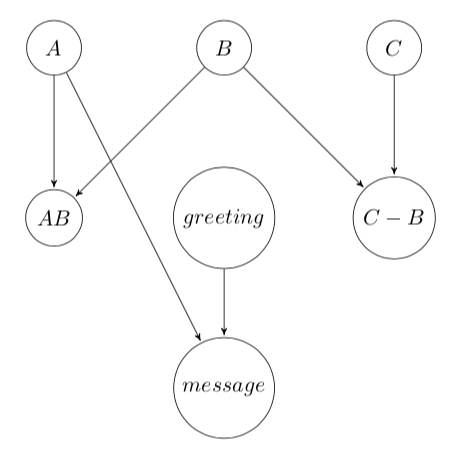

# artifax

artifax is a Python package to evaluate nodes in a computation graph where
the dependencies associated with each node are extracted directly from their
function signatures.

A computation graph can be entirely encoded in a standard python dictionary.
Each key represents a node or an artifact, that will eventually be computed
once all of its dependecies have been calculated. The value associated with
each key can be any constant - a string, a number or an instance of a class,
or a function. In the latter case, the function arguments may map to other nodes
in the computation graph to establish a direct dependency between the nodes.

For example, the following dictionary:

```python
artifacts = {
    'A': 42,
    'B': 7,
    'C': lambda: 10,
    'AB': lambda A, B: A*B,
    'C-B': lambda B, C: C() - B,
    'greeting': 'Hello',
    'message': lambda greeting, A: '{} World! The answer is {}.'.format(greeting, A)
}
```
yields the following computation graph:


<div style="font-style:italic">Figure 1. Example of a computation graph.</div>

The `build` function evalutes the entire computation graph and returns a new dictionary
with the same keys as the original one and with the calculated values for each of the nodes
in the computation graph.

```python
from artifax import build

artifacts = {
    'A': 42,
    'B': 7,
    'C': lambda: 10,
    'AB': lambda A, B: A*B,
    'C-B': lambda B, C: C() - B,
    'greeting': 'Hello',
    'message': lambda greeting, A: '{} World! The answer is {}.'.format(greeting, A)
}
result = build(artifacts)

for k, v in result.items():
    print('{:<10}: {}'.format(k, v))
```
outputs
```shell
A         : 42
B         : 7
C         : functools.partial(<function <lambda> at 0x102c4fae8>)
AB        : 294
C-B       : 3
greeting  : Hello
message   : Hello World! The answer is 42.
```

# Artifax class

In addition to the `build` function, artifacts can be built by `Artifax` class
instances.

```python
from artifax import Artifax

afx = Artifax()
afx.set('a', 42)
afx.set('b', lambda a: a*2)
afx.set('c', lambda b: -b)

print(len(afx)) # prints 3
print('b' in afx) # prints True

results = afx.build()
for k, v in results.items():
    print(k, v)
```
```
c -84
a 42
b 84
```

Artifax instances optimize sequential builds by only re-evaluating nodes that
have become stale due to an update. For example, given the graph illustrated in
Figure 1, if node `B` is updated, e.g, `afx.set('B', -5))`, nodes `B`, `AB` and
`C-B` get re-evaluated when the build method is invoked, but not any other
nodes.

In the example below, the second call to the `build` method triggers a
re-evaluation of node `p1` and all the nodes that depend on it. Nodes `v2` and
`m2`, on the other hand, do not require re-evaluation since they do not depend
on the updated node.

```python
import artifax
import math

class Vector:
    def __init__(self, u, v):
        self.u = u
        self.v = v
    def magnitude(self):
        print('Calculating magnitude of vector {}...'.format(self)
        return math.sqrt(self.u**2 + self.v**2)
    def __repr__(self):
        return '({}, {})'.format(self.u, self.v)

afx = artifax.Artifax({
    'p1': (3, 4),
    'v1': lambda p1: Vector(*p1),
    'm1': lambda v1: v1.magnitude(),
    'v2': Vector(5, 12),
    'm2': lambda v2: v2.magnitude()
})
_ = afx.build()
print('Updating p1...')
afx.set('p1', (1, 1))
_ = afx.build()
```

```
Calculating magnitude of vector (3, 4)...
Calculating magnitude of vector (5, 12)...
Updating p1...
Calculating magnitude of vector (1, 1)...
```

# Targeted builds
The `build` method accepts an optional argument that specifies which node in
your computation graph should be built. Instead of returning the usual dictionary,
targeted builds return the value associated with the target node.

```python
terminal_node_value = afx.build(target='terminal_node')
```

Targeted builds only evaluate depencies for the target node and the target node itself.
Any other nodes in the computation graph do not get evaluated.

```python
import math
from artifax import Artifax
class C:
    counter = 0
    def __init__(self):
        C.counter += 1
afx = Artifax({
    'a': 42,
    'b': lambda a: math.pow(a, 2),
    'c': lambda: C(),
})
print(result, type(result)) # 1764.0 <class 'float'>
print(C.counter) # 0
_ = afx.build()
print(C.counter) # 1
```

Targeted builds might be an efficient way of retrieving certain nodes
without the need to evaluate the entire computation graph.

# Error handling

If the computation graph represented by the artifacts dictionary is not a DAG,
a `CircularDependencyError` exception is thrown.

```python
import artifax
try:
    _ = artifax.build({'x': lambda x: x+1})
except artifax.CircularDependencyError as err:
    print('Cannot build artifacts: {}'.format(err))
```
```
Cannot build artifacts: artifact graph is not a DAG
```
